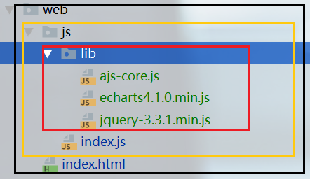

# AJS API 说明

AJS基于[JsBridge](https://github.com/lzyzsd/JsBridge)封装

### 使用说明
在js目录中新建lib目录，将[ajs-core.js](../app/src/main/assets/web/js/lib/ajs-core.js) 、 [jquery-3.3.1.min.js](../app/src/main/assets/web/js/lib/jquery-3.3.1.min.js)、 [vconsole.min.js](../app/src/main/assets/web/js/lib/vconsole.min.js)放在lib下 ，若使用[echarts4.1.0.min.js](../app/src/main/assets/web/js/lib/echarts4.1.0.min.js)、[zepto.js](../app/src/main/assets/web/js/lib/zepto.js)等其他js库可一并引入，确保不冲突即可。

在新建的HTML中引入以上文件

在新建的js代码中，添加如下方法，此方法在环境加载完成后调用，您的代码从这里开始
```js
function onEnvReady() {

}
```

目录结构如下：



[demo及源码](../app/src/main/assets/web/)

具体api调用[参考demo](../app/src/main/assets/web/js/index.js)


### 框架原生容器介绍
原生框架中每个页面提供两种容器进行布局（原生页面和h5页面都是如此，Android原生的童鞋可以[参考原生布局源码](../core/src/main/res/layout/layout_frm_base.xml)）。
- 容器1 中已经包含smartrefreshlayout(下拉刷新和上拉加载更多的控件)和topbar(标题栏)和状态页(h5无需关心)
- 容器2 包含标题栏和状态页，不包含smartrefreshlayout
- 另外如果不使用这两种容器，会直接将页面布局加载在根布局中，相当于把页面放置在空容器中
  
<b>ajs默认的h5页面在`ajs1.0.0.d`(不包括此版本)之后已经从第1容器切换为第2容器</b>

todo   切换原生容器的方法将会在后续推出...

### 目录
- [AJS API 说明](#ajs-api-说明)
- [使用说明](#使用说明)
- [一、 调用原生api](#一-调用原生api)
  - [1 设置原生标题栏](#1-设置原生标题栏)
    - [1.1 设置标题栏颜色](#11-设置标题栏颜色)
    - [1.2 设置标题栏标题文字](#12-设置标题栏标题文字)
    - [1.3 隐藏/显示标题](#13-隐藏显示标题)
    - [1.4 设置状态栏](#14-设置状态栏)
    - [1.5 获取状态栏高度](#15-获取状态栏高度)
  - [2 一些常用方法](#2-一些常用方法)
    - [2.1 模拟返回键](#21-模拟返回键)
    - [2.2 消息弹窗](#22-消息弹窗)
    - [2.3 根据图片本地路径获取到可用于加载的图片路径](#23-根据图片本地路径获取到可用于加载的图片路径)
    - [2.4 使用原生图片预览](#24-使用原生图片预览)
    - [2.5 跳转原生页面](#25-跳转原生页面)
    - [2.6 打开新页面加载h5页面](#26-打开新页面加载h5页面)
    - [2.7 打开扫描二维码条形码页面](#27-打开扫描二维码条形码页面)
    - [2.8 开启截图监听](#28-开启截图监听)
  - [3 Toast吐司](#3-toast吐司)
  - [4 加载弹窗](#4-加载弹窗)
  - [5 缓存](#5-缓存)
  - [6 文件操作](#6-文件操作)
    - [6.1 选择图片/拍照获取图片](#61-选择图片/拍照获取图片)
    - [6.2 获取文件base64](#62-获取文件base64)
    - [6.3 删除文件](#63-删除文件)
  - [7 原生的下拉刷新和加载更多:smartrefresh](#7-原生的下拉刷新和加载更多smartrefresh)
    - [7.1 开启/关闭下拉刷新](#71-开启关闭下拉刷新)
    - [7.2 开启/关闭下拉刷新](#72-开启关闭下拉刷新)
    - [7.3 设置刷新主题颜色](#73-设置刷新主题颜色)
    - [7.4 设置下拉刷新样式](#74-设置下拉刷新样式)
    - [7.5 设置上拉加载样式](#75-设置上拉加载样式)
- [二、提供原生调用的方法](#二提供原生调用的方法)


## 一、 调用原生api

所有api包括原始方法在环境加载完成后(onEnvReady方法中)才可以调用

api原始方法(<b>tip:初次看文档可以先看下面的api，之后再回过来看原始方法</b>)

```js
myBridge.callHandler(callname, params, function (responseData) {

})
```
- 参数1 callname  调用的原生方法的name
- 参数2 params 传入方法需要的相关参数
- 参数3 callback  这是调用原生方法后的回调,回调的参数responseData为string类型
- demo
  ```js
    myBridge.callHandler('topbar.bgcolor', { color: "#EE7AE9" }, function (responseData) {
        var data = JSON.parse(responseData)
        if (data['result'].toString() == "1") {
            console.log("topbar.bgcolor success")
        } else {
            console.log("topbar.bgcolor failed")
        }
    })
  ```

<b>以下介绍的方法是已有api进行了封装以简化调用，使用原始方法皆可调用，若项目中临时添加api，则需要使用原始方法调用</b>

### 1 设置原生标题栏

#### 1.1 设置标题栏颜色

方法：`ajs.topbar.bgcolor()`

参数：
- 参数1: color 
  
    值: 颜色值 '#000000'

  | 字段  | 描述       | 必填 | 说明                         |
  | ----- | ---------- | ---- | ---------------------------- |
  | color | 标题背景色 | 是   | 必须是#开头，后面6位的颜色值 |

- 参数2: success  成功回调  可选
- 参数3: error  错误回调  可选
  
- demo:
```js
    //设置topbar背景颜色
    ajs.topbar.bgcolor("#EE7AE9", function (data) {
        console.log("topbar.bgcolor success")
    }, function (msg, data) {
        console.log("topbar.bgcolor failed")
    });
```

#### 1.2 设置标题栏标题文字

方法：`ajs.topbar.title()`

参数：
- 参数1: param 

    值：`{text:'设置title', color:'#E8E8E8', size:22}`

  | 字段  | 描述         | 必填 | 说明                         |
  | ----- | ------------ | ---- | ---------------------------- |
  | text  | 标题文字     | 否   |                              |
  | color | 标题字体颜色 | 否   | 必须是#开头，后面6位的颜色值 |
  | size  | 标题字体大小 | 否   |                              |

- 参数2: success  成功回调  可选
- 参数3: error  错误回调  可选
  
- demo:
```js
    //设置topbar文字  参数都是可选
    ajs.topbar.title({
        text: '设置title',
        color: '#E8E8E8',
        size: 22
    }, function (data) {
        console.log("topbar.title success")
    }, function (message, data) {
        console.log("topbar.title failed")
    });
```

#### 1.3 隐藏/显示标题

方法：`ajs.topbar.hide()`

参数：
- 参数1: hide 
  
    值: false / true 
  
  | 字段 | 描述             | 必填 | 说明              |
  | ---- | ---------------- | ---- | ----------------- |
  | hide | 隐藏或显示标题栏 | 是   | 可选值 true/false |

- 参数2: success  成功回调  可选
- 参数3: error  错误回调  可选
  
- demo:
```js
    //设置topbar文字  参数都是可选
    ajs.topbar.hide(true, function (result) {
        console.log(typeof result)
        console.log(result)
    });
```


#### 1.4 设置状态栏

方法：`ajs.topbar.statusbar()`

参数：
- 参数1: mode 
  
    值: 1 / others
  
  | 字段 | 描述           | 必填 | 说明                                                               |
  | ---- | -------------- | ---- | ------------------------------------------------------------------ |
  | mode | 状态栏字体颜色 | 是   | 可选值 1或其他值，1 表示状态栏白色字体，其余参数表示标题栏黑色字体 |

- 参数2: success  成功回调  可选
- 参数3: error  错误回调  可选
  
- demo:
```js
    //设置状态栏字体颜色   参数    1:白色   其他参数 ：黑色
    ajs.topbar.statusbar(0, function (data) {
        console.log("topbar.statusbar success")
    }, function (msg, data) {
        console.log("topbar.statusbar failed")
    })
```

#### 1.5 获取状态栏发哦度

方法：`ajs.topbar.statusbarHeight()`

参数：
- 参数1: success  成功回调  可选
- 参数2: error  错误回调  可选
  
- demo:
```js
    ajs.topbar.statusbarHeight(function (data) {
        ajs.toast.info("状态栏高度:" + data['height'])
    }, function (msg, data) {
        console.log("error:" + msg)
    })
```

### 2 一些常用方法

#### 2.1 模拟返回键

方法：`ajs.common.back();`

参数：

- 参数1: success  成功回调  可选
- 参数2: error  错误回调  可选
  
- demo:
```js
    //有回调
    ajs.common.back(function (data) {
        console.log("common.back success")
    }, function (msg, data) {
        console.log("common.back failed")
    });

    //无回调简化调用
    ajs.common.back();
```


#### 2.2 消息弹窗

方法：`ajs.common.messagedialog()`

参数：

- 参数1: param 

  值: 
```js
    {
        title: '提示',
        message: "这是一个提示",
        // cancelable: false,
        action1: "取消",
        method1: "dialogaction1",
        params1: JSON.stringify({ param1: "aaa", param2: "bbb" }),
        action2: "确定",
        action2mode: 1,
        method2: "dialogaction2",
        params2: "params222"
    }
```

  | 字段        | 描述                      | 必填 | 说明                                                                        |
  | ----------- | ------------------------- | ---- | --------------------------------------------------------------------------- |
  | title       | 弹窗标题                  | 否   |                                                                             |
  | message     | 弹窗文本内容              | 否   |                                                                             |
  | cancelable  | 点击弹窗外部是否可取消    | 否   | 可选值 true/false                                                           |
  | action1     | 弹窗按钮1的文字           | 否   |                                                                             |
  | action1mode | 弹窗按钮1的样式           | 否   | 传值1，字体为红色，默认为0                                                  |
  | method1     | 弹窗按钮1的回调方法       | 否   | 此处传原生调用的方法名                                                      |
  | params1     | 弹窗按钮1的回调方法的参数 | 否   | 这些参数原生会返回到上面的方法中;<br>确保参数是字符串，使用JSON.stringify() |
  | action2     | 弹窗按钮2的文字           | 否   |                                                                             |
  | action2mode | 弹窗按钮2的样式           | 否   | 传值1，字体为红色，默认为0                                                  |
  | method2     | 弹窗按钮2的回调方法       | 否   | 此处传原生调用的方法名                                                      |
  | params2     | 弹窗按钮2的回调方法的参数 | 否   | 这些参数原生会返回到上面的方法中;<br>确保参数是字符串，使用JSON.stringify() |

注：后文会介绍如何给原生提供js方法

- 参数2: success  成功回调  可选
- 参数3: error  错误回调  可选
  
- demo:
```js
    //消息弹窗 参数都是可选
    ajs.common.messagedialog({
        title: '提示',
        message: "这是一个提示",
        // cancelable: false,
        action1: "取消",
        method1: "dialogaction1",
        params1: JSON.stringify({ param1: "aaa", param2: "bbb" }),
        action2: "确定",
        action2mode: 1,
        method2: "dialogaction2",
        params2: "params222"
    }, function (data) {
        console.log("common.dialog success")
    }, function (msg, data) {
        console.log("common.dialog failed")
    })
```


#### 2.3 根据图片本地路径获取到可用于加载的图片路径

方法：`ajs.common.localpic();`

参数：

- 参数1: path 
  
    值:  图片本地路径
  
  | 字段 | 描述         | 必填 | 说明 |
  | ---- | ------------ | ---- | ---- |
  | path | 图片本地路径 | 是   |      |

- 参数2: success  成功回调  可选
- 参数3: error  错误回调  可选

    说明:方法回调的的path参数获取可用于加载的图片路径 data['path']
  
- demo:
```js
    ajs.common.localpic("/storage/emulated/0/Pictures/Screenshots/1444875167806.png", function (data) {
        val picUrl= data["path"].toString()
        $("#myimg").attr("src", picPath);
    });
```


#### 2.4 使用原生图片预览

方法：`ajs.common.showpic();`

参数：

- 参数1: urls 

    值 图片url数组，不支持本地图片

- 参数2: index 

    值：打开时显示的图片下标
  
  | 字段  | 描述                     | 必填 | 说明                   |
  | ----- | ------------------------ | ---- | ---------------------- |
  | urls  | 图片url数组              | 是   | ['url1','url2','url3'] |
  | index | 值：打开时显示的图片下标 | 是   |                        |
    
- 参数3: success  成功回调  可选
- 参数4: error  错误回调  可选

- demo:
```js
    var urls = [
        "http://img5.imgtn.bdimg.com/it/u=3300305952,1328708913&fm=26&gp=0.jpg",
        "https://ss0.bdstatic.com/70cFuHSh_Q1YnxGkpoWK1HF6hhy/it/u=508387608,2848974022&fm=27&gp=0.jpg",
        "https://ss1.bdstatic.com/70cFvXSh_Q1YnxGkpoWK1HF6hhy/it/u=3893146502,314297687&fm=27&gp=0.jpg",
    ]
    ajs.common.showpic(urls, 0)
```


#### 2.5 跳转原生页面

方法：`ajs.common.go();`

参数：

- 参数1: activity 

    值 原生页面路径，由原生提供

  | 字段     | 描述         | 必填 | 说明       |
  | -------- | ------------ | ---- | ---------- |
  | activity | 原生页面路径 | 是   | 由原生提供 |
 
- 参数2: success  成功回调  可选
- 参数3: error  错误回调  可选
  
- demo:
```js
    ajs.common.go("com.jsongo.app.view.activity.MyPageActivity")
```


#### 2.6 打开新页面加载h5页面

方法：`ajs.common.load();`

- 参数1: params

  值: 
```js
    {
        url: "https://www.baidu.com",
        showTopBar: false,
        showProgress: false,
        bgColor: "#ffffff",
        fixHeight: true
    }
```

  | 字段 | 描述 | 必填 | 说明 |
  | ---- | ---- | ---- | ---- |-------------------------------------------------- |
  | url         | h5页面地址     |  是  |                                                      |
  | showTopBar  | 是否显示标题栏 |  否  | 默认是                                               |
  | showProgress  | 是否显示加载进度 |  否  | 默认是                                               |
  | bgColor     | 背景色         |  否  | 修复状态栏高度使用的背景色                           |
  | fixHeight   | 是否修复高度   |  否  | 默认是,在隐藏标题栏时,不修复高度,会导致内容顶到状态栏|
 
- 参数2: success  成功回调  可选
- 参数3: error  错误回调  可选
  
- demo:
```js
    //加载百度
    ajs.common.load({url:"https://www.baidu.com"})
    //加载本地h5页面
    ajs.common.load({url:"file:///android_asset/web/index.html"})
```


#### 2.7 打开扫描二维码条形码页面

方法：`ajs.common.scan();`

参数：

- 参数1: requestCode 

  | 字段        | 描述          | 必填 | 说明            |
  | ----------- | ------------- | ---- | --------------- |
  | requestCode | 长回调请求码, | 是   | 自定义,不可冲突 |
 
- 参数2: success  成功回调  可选
- 参数3: error  错误回调  可选


返回值:

- data["data"] 扫描的得到的结果
  
- demo:
```js
    ajs.common.scan(107, function (data) {
        console.log(data)
        ajs.common.load(data["data"])
    })
```
#### 2.8 开启截图监听

方法：`ajs.common.enableScreenshotObserve();`

参数：
- 参数1: success  成功回调
- 参数2: error  错误回调  可选


返回值:

- data["path"] 监听到的截图文件的路径
  
- demo:
```js
    ajs.common.enableScreenshotObserve(function (data) {
        console.log(data["path"])
    },function(msg,data){
        console.log("screenshot observe failed:" + msg)
    })
```

### 3 Toast吐司
| 调用方法              | 方法类型 | 吐司颜色 |
| --------------------- | -------- | -------- |
| `ajs.toast.error()`   | 错误     | 红色     |
| `ajs.toast.warning()` | 警告     | 黄色     |
| `ajs.toast.info()`    | 提示     | 蓝色     |
| `ajs.toast.normal()`  | 普通     | 黑色     |
| `ajs.toast.success()` | 成功     | 绿色     |

参数：

- 参数1: text 
  
    值:  吐司内容
  
  | 字段 | 描述     | 必填 | 说明 |
  | ---- | -------- | ---- | ---- |
  | text | 吐司内容 | 是   |      |
  
- 参数2: success  成功回调  可选
- 参数3: error  错误回调  可选
  
- demo:
```js
    //toast回调
    var toastSuccess = function (data) {
        console.log("toast success")
    };
    var toastError = function (msg, data) {
        console.log("toast failed")
    };

    var type = "1";// "1"  "2"  "3"  "4"  "5" 
    switch (type) {
        case "2":
            ajs.toast.warning("warning toast", toastSuccess, toastError);
            break;
        case "3":
            ajs.toast.info("info toast", toastSuccess, toastError);
            break;
        case "4":
            ajs.toast.normal("normal toast", toastSuccess, toastError);
            break;
        case "5":
            ajs.toast.success("success toast", toastSuccess);
            break;
        default:
            ajs.toast.error("error toast");
    }
```

### 4 加载弹窗

| 调用方法                   | 方法说明             | 参数                                                       |
| -------------------------- | -------------------- | ---------------------------------------------------------- |
| `ajs.loading.show()`       | 显示加载dialog       | success 成功回调    error 错误参数                         |
| `ajs.loading.hide()`       | 隐藏加载dialog       | success 成功回调    error 错误参数                         |
| `ajs.loading.cancelable()` | 设置dialog是否可取消 | true/false 必选<br/>    success 成功回调    error 错误参数 |

- demo
```js
    ajs.loading.show(function (data) {
        console.log("loading success")
    }, function (msg, data) {
        console.log("loading failed")
    });
    ajs.loading.cancelable(true)
    ajs.loading.hide()
```

### 5 缓存
| 调用方法        | 方法说明 | 参数                                                                    |
| --------------- | -------- | ----------------------------------------------------------------------- |
| ajs.cache.put() | 保存键值 | key(键) value(值)  success 成功回调    error 错误参数                   |
| ajs.cache.get() | 取出  值 | key(键)  success 成功回调,通过data["value"]取返回的值    error 错误参数 |
- demo
```js
    ajs.cache.put("h5Cache", "这是我的缓存内容");

    ajs.cache.get("h5Cache", function (data) {
        ajs.toast.normal(data["value"])
    })
```

### 6 文件操作

#### 6.1 选择图片/拍照获取图片

方法：`ajs.file.selectImg();`

参数：

- 参数1: param 

  值: 
```js
    {
        requestCode: 601,
        count: 5,
        showCamera: 1,
        seletedPaths: JSON.stringify(["/storage/emulated/0/path1","/storage/emulated/0/path2"])
    }
```

  | 字段         | 描述                           | 必填 | 说明                       |
  | ------------ | ------------------------------ | ---- | -------------------------- |
  | requestCode  | 请求码,自定义整型数字,不可重复 | 是   |                            |
  | count        | 选取的数量                     | 否   |                            |
  | showCamera   | 是否显示拍照按钮               | 否   |                            |
  | seletedPaths | 已选的图片路径                 | 否   | 使用"/sdcard/path"可能无效 |

- 参数2: success  成功回调  可选
- 参数3: error  错误回调  可选

返回值  
     当回调成功时,通过`data["paths"]`获取选取的文件路径的数组
  
- demo:
```js
    ajs.file.selectImg({
            count:4,
            showCamera:1,
            requestCode:302,
            selectedPaths:JSON.stringify(["/storage/emulated/0/ADM/face1.jpg","/storage/emulated/0/ADM/face2.jpg"])
    }, function (data) {
        console.log(data["paths"])
    })
```

##### 6.2 获取文件base64

方法：`ajs.file.base64();`

参数：

- 参数1: path 


  | 字段 | 描述      | 必填 | 说明 |
  | ---- | --------- | ---- | ---- |
  | path | 文件路径, | 是   |      |
 
- 参数2: success  成功回调  可选
- 参数3: error  错误回调  可选


返回值:

- data["base64"] 文件的base64的字符串
  
- demo:
```js
    ajs.file.base64("/sdcard/xxx.jpg", function (data) {
        console.log(data)
    })
```

##### 6.3 删除文件

方法：`ajs.file.delete();`

参数：

- 参数1: path 


  | 字段 | 描述      | 必填 | 说明 |
  | ---- | --------- | ---- | ---- |
  | path | 文件路径, | 是   |      |
 

- 参数2: success  成功回调  可选
- 参数3: error  错误回调  可选
  
- demo:
```js
    ajs.file.delete("/sdcard/xxx.jpg", function (data) {
        console.log(data)
    })
```

### 7 原生的下拉刷新和加载更多:smartrefresh

<b>注：
- 已经将h5页面的容器切换为第二容器，第二容器不包含此原生控件，如需使用，需要先切换为原生的第一容器
- 此原生控件会与h5页面产生滑动冲突！！！</b>

 说明: 默认开启下拉刷新  不开启上拉加载更多

#### 7.1 开启/关闭下拉刷新

方法：`ajs.smartrefresh.enableRefresh()`

参数：

- 参数1: enable 

    值 true/false

  | 字段   | 描述             | 必填 | 说明                            |
  | ------ | ---------------- | ---- | ------------------------------- |
  | enable | 是否启用下拉刷新 | 是   | true/false,页面默认启用下拉刷新 |
 
- 参数2: success  成功回调  可选
- 参数3: error  错误回调  可选
  
- demo:
```js
    //启用
    ajs.smartrefresh.enableRefresh(true)
    //禁用
    ajs.smartrefresh.enableRefresh(false)
```


#### 7.2 开启/关闭下拉刷新

方法：`ajs.smartrefresh.enableLoadmore()`

参数：

- 参数1: enable 

    值 true/false

  | 字段   | 描述                 | 必填 | 说明                                |
  | ------ | -------------------- | ---- | ----------------------------------- |
  | enable | 是否启用上拉加载更多 | 是   | true/false,页面默认禁用上拉加载更多 |
 
- 参数2: success  成功回调  可选
- 参数3: error  错误回调  可选
  
- demo:
```js
    //启用
    ajs.smartrefresh.enableLoadmore(true)
    //禁用
    ajs.smartrefresh.enableLoadmore(false)
```


#### 7.3 设置刷新主题颜色

方法：`ajs.smartrefresh.color()`

参数：

- 参数1: primaryColor 

    值 #开头后面6位的色值

- 参数2: accentColor 

    值 #开头后面6位的色值

  | 字段         | 描述         | 必填 | 说明                                      |
  | ------------ | ------------ | ---- | ----------------------------------------- |
  | primaryColor | 刷新的背景色 | 是   | #开头后面6位的色值 有的样式不建议更改颜色 |
  | accentColor  | 刷新的前景色 | 是   | #开头后面6位的色值 有的样式不建议更改颜色 |
 
- 参数3: success  成功回调  可选
- 参数4: error  错误回调  可选
  
- demo:
```js
    ajs.smartrefresh.color('#db8fb1', '#000000')
```


#### 7.4 设置下拉刷新样式

方法：`ajs.smartrefresh.header()`

参数：

- 参数1: header 

    值 参考 `smartrefresh.header.xxx`

- 参数2: success  成功回调  可选
- 参数3: error  错误回调  可选

- 下拉刷新样式参考：
  | 样式名                  | 值                                          | 说明                                                                     |
  | ----------------------- | ------------------------------------------- | ------------------------------------------------------------------------ |
  | DeliveryHeader          | smartrefresh.header.DeliveryHeader          | 气球                                                                     |
  | DropBoxHeader           | smartrefresh.header.DropBoxHeader           | 盒子                                                                     |
  | BezierRadarHeader       | smartrefresh.header.BezierRadarHeader       | 贝塞尔雷达 颜色更换异常！ 不建议是使用                                   |
  | BezierCircleHeader      | smartrefresh.header.BezierCircleHeader      | 贝塞尔圆圈 颜色可改                                                      |
  | FlyRefreshHeader        | smartrefresh.header.FlyRefreshHeader        | 纸飞机 无效果！                                                          |
  | ClassicsHeader          | smartrefresh.header.ClassicsHeader          | 经典刷新 颜色可改                                                        |
  | PhoenixHeader           | smartrefresh.header.PhoenixHeader           | 金色校园 颜色不建议更改                                                  |
  | TaurusHeader            | smartrefresh.header.TaurusHeader            | 飞机冲上云霄 颜色不建议更改                                              |
  | FunGameBattleCityHeader | smartrefresh.header.FunGameBattleCityHeader | 战争城市游戏 颜色不建议更改                                              |
  | FunGameHitBlockHeader   | smartrefresh.header.FunGameHitBlockHeader   | 打砖块游戏 颜色不建议更改                                                |
  | WaveSwipeHeader         | smartrefresh.header.WaveSwipeHeader         | 全屏水波 颜色可更改                                                      |
  | MaterialHeader          | smartrefresh.header.MaterialHeader          | material 颜色不可更改                                                    |
  | StoreHouseHeader        | smartrefresh.header.StoreHouseHeader        | StoreHouse 颜色可更改 内容只可设置英文<br/>.initWithString("loading...") |
  | WaterDropHeader         | smartrefresh.header.WaterDropHeader         | 水滴 颜色可更改                                                          |


- demo
```js
    ajs.smartrefresh.header(smartrefresh.header.MaterialHeader)
```

#### 7.5 设置上拉加载样式

方法：`ajs.smartrefresh.footer()`

参数：

- 参数1: footer 

    值 参考 `smartrefresh.footer.xxx`

- 参数2: success  成功回调  可选
- 参数3: error  错误回调  可选

- 上拉加载样式参考:
  | 样式名          | 值                                  | 说明                     |
  | --------------- | ----------------------------------- | ------------------------ |
  | BallPulseFooter | smartrefresh.footer.BallPulseFooter | 球脉冲  颜色可改         |
  | ClassicsFooter  | smartrefresh.footer.ClassicsFooter  | 经典加载更多  颜色不可改 |

- demo
```js
    ajs.smartrefresh.footer(smartrefresh.footer.BallPulseFooter)
```

## 二、提供原生调用的方法

在环境初始化完成后可以注册方法给原生调用，可以写在如下方法中
```js
function regHandler() {
    //在这个方法里注册js方法供原生调用
}
```

原始方法
```js
function regHandler() {
    WebViewJavascriptBridge.registerHandler("dialogaction2", function (data, responseCallback) {

        //do your things here

        //回调数据
       var responseData = "response from js on dialogaction2";
       responseCallback(responseData);
   });
}

```
封装后
```js
//这这里将js方法注册给原生调用
function regHandler() {
    //注册方法
    ajs.regHandler("dialogaction2", dialogaction2);
}
function dialogaction2(data, responseCallback) {

        //do your things here

        //回调数据
    var responseData = "response from js on dialogaction2";
    responseCallback(responseData);
}
```
其中 
- 第一个参数 是给原生的方法名
- data  是原生调用此方法传来的参数
- responseCallback 是方法执行完给原生的回调
- demo
```js
//这这里将js方法注册给原生调用
function regHandler() {
    //注册方法
    ajs.regHandler("dialogaction2", dialogaction2);
}
function dialogaction2(data, responseCallback) {
    console.log("dialogaction2 params:" + data);
    ajs.toast.normal("action2");
    var responseData = "response from js on dialogaction2";
    responseCallback(responseData);
}
```